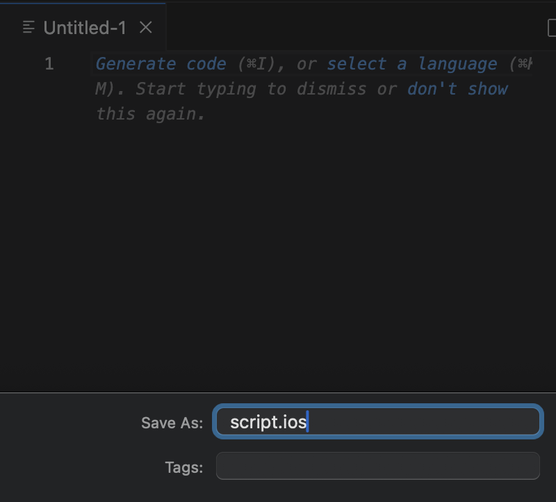
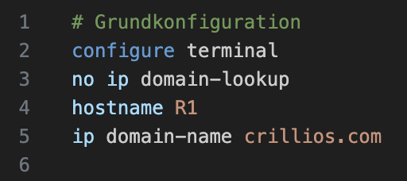

# Nutzung und Features
- Öffne bzw. erstelle eine Datei mit Dateiendung `.ios`
    -> das Plugin ist nun automatisch aktiv.

    

## Autovervollständigung
- Tippe einen Befehl (z. B. `configure`) und warte auf einen Vorschhlag.
    
    

- Kontextsensitiv: Vorschläge passen sich den Modi an.

## Syntax-Highlighting
- Befehle, Userinput, Kommentare und weitere werden automatisch farblich unterschieden.

    

## Validierung & Hinweise
- Fehler, Warnungen und Infos erscheinen in der Problems-Ansicht.
- Hover über markierte Stellen zeigt Details.

## Best-Practices
- Das Plugin schlägt empfohlene Commands vor.
- Achte auf Hinweise im Skript und in der Problems-Ansicht.

## Nützliche VSCode-Befehle
- „Go to Definition“ (falls verfügbar): Springe zu Definitionen.

Hier geht es weiter zu [Beispielen](./examples.md) des Plugins.